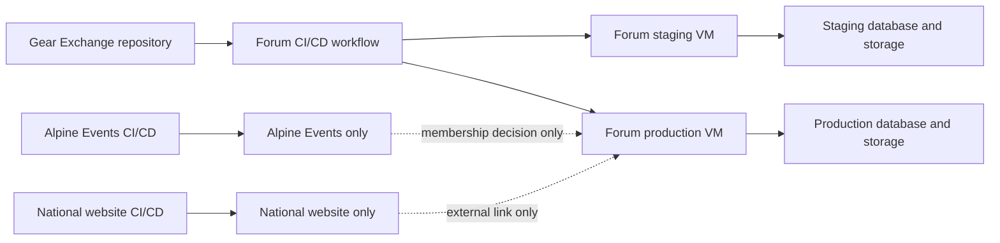

# Flarum Deployment Boundary

Date: 2026-08-31
Status: Required before Flarum staging provisioning

## Decision

Deploy the National Community Forum, including its Gear Exchange area, as an independent service. It must not share a deployment workflow, release artifact, App Service, database, storage container, service identity, or production secret with PHW Alpine Events or the National website.

Create a dedicated repository named `phw-national-gear-exchange` before provisioning the staging forum. That repository owns the Flarum application lockfile, infrastructure-as-code, Nginx configuration, deployment workflow, backup scripts, operational checks, and forum-specific documentation copied or linked from this planning dossier.

This repository remains the authority for PHW member eligibility and the future membership adapter only. The National website and Alpine Events link to the forum; they do not deploy it.

## Deployment Topology



## Repository Layout

```text
phw-national-gear-exchange/
  .github/workflows/
    validate.yml
    deploy-staging.yml
    deploy-production.yml
    backup-restore-drill.yml
  infrastructure/
    staging/
    production/
  deploy/
    nginx/
    systemd/
    scripts/
  flarum/
    composer.json
    composer.lock
  docs/
    operations/
    release-evidence/
```

Do not commit Flarum runtime state, database dumps, uploaded member content, `.env` files, Key Vault secret values, SMTP credentials, or identity-provider credentials.

## CI/CD Responsibilities

| Workflow | Trigger | Responsibility | Cannot do |
| --- | --- | --- | --- |
| `validate.yml` | Pull request and push | Validate infrastructure definitions, Composer lockfile, dependency/security checks, configuration templates, and documentation links | Connect to production or send email |
| `deploy-staging.yml` | Approved manual dispatch after validation | Build/promote the locked Flarum release to staging; run synthetic sign-in, permission, SMTP-safe, backup, and extension checks | Deploy production or use production secrets |
| `deploy-production.yml` | Protected manual dispatch with release approval | Create backup, promote the already-validated release, run read-only/synthetic production checks, and record release evidence | Run unreviewed Composer updates or alter Alpine Events |
| `backup-restore-drill.yml` | Scheduled and protected manual dispatch | Verify backup completion and restore to an isolated non-email environment | Expose restored data or send mail |

Use GitHub Environments named `flarum-staging` and `flarum-production`. Require environment approval for production and scope each environment to its own Azure deployment identity and Key Vault references. The production workflow must accept only a release commit already deployed and validated in staging.

## Azure Resource Boundary

Create forum-specific resources with an `phw-gear-exchange-` prefix:

- Separate resource groups for staging and production
- Dedicated Linux VMs and managed identities
- Separate database servers/databases or a clearly isolated managed database boundary
- Separate object storage containers/accounts for forum assets and backups
- Separate Key Vault secret names and access policies
- Separate Log Analytics/monitoring alerts and SMTP credentials or sender identity
- Separate DNS records and TLS certificates

The PHW membership adapter may call the Alpine Events API through a narrowly scoped, server-to-server credential. It must not use deployment credentials, database credentials, an administrator token, or a browser access token. Alpine Events must expose no forum write access through that adapter.

## Configuration and Secret Contract

The forum service owns its own configuration names, for example:

- `FLARUM_APP_URL`
- `FLARUM_DB_*`
- `FLARUM_MAIL_*`
- `FLARUM_STORAGE_*`
- `FLARUM_ENTRA_*`
- `PHW_MEMBERSHIP_ADAPTER_URL`
- `PHW_MEMBERSHIP_ADAPTER_CLIENT_ID`
- `PHW_MEMBERSHIP_ADAPTER_CLIENT_SECRET`

Names are illustrative; final names are recorded in the forum repository. Keep the existing Alpine Events secrets, including `AUTH_BOOTSTRAP_ADMIN_EMAILS`, within the Alpine Events workflow only. A forum administrator bootstrap/allowlist, if needed, is a distinct forum secret with an independent owner and rotation process.

## Promotion Procedure

1. Merge a reviewed forum-only change into the Gear Exchange repository.
2. `validate.yml` completes without production connectivity.
3. An operator dispatches `deploy-staging.yml` using synthetic data and staging secrets.
4. The staging checklist verifies forum privacy, identity eligibility, denial paths, tags, moderation, attachments, SMTP-safe behavior, monitoring, and restore readiness.
5. Record the commit SHA, lockfile hash, infrastructure revision, validation evidence, and rollback point.
6. A protected production approval dispatches the exact validated revision.
7. Take and verify a production backup before promotion.
8. Promote with a short read-only window if database migrations require it; otherwise preserve service availability.
9. Run post-deploy checks that do not send uncontrolled email or create member-visible test content.
10. Record release evidence and retain the prior locked release for rollback.

## Immediate Next Steps

1. Create the empty `phw-national-gear-exchange` repository with branch protection and `flarum-staging`/`flarum-production` environments.
2. Assign Azure resource, Key Vault, DNS, SMTP, and operational owners.
3. Provision only isolated staging resources using [flarum-infrastructure-runbook.md](flarum-infrastructure-runbook.md).
4. Install a pinned Flarum baseline and execute the identity Path A proof of concept from [flarum-entra-integration-design.md](flarum-entra-integration-design.md).
5. Add a simple external forum link to the National website and Alpine Events only after the staging forum has a stable HTTPS URL. Do not make that link production-visible until the pilot gate passes.

## References

- [National Gear Exchange Flarum ADR](national-gear-exchange-flarum-adr.md)
- [Flarum infrastructure runbook](flarum-infrastructure-runbook.md)
- [Flarum build backlog](flarum-build-backlog.md)
- [Flarum Entra integration design](flarum-entra-integration-design.md)