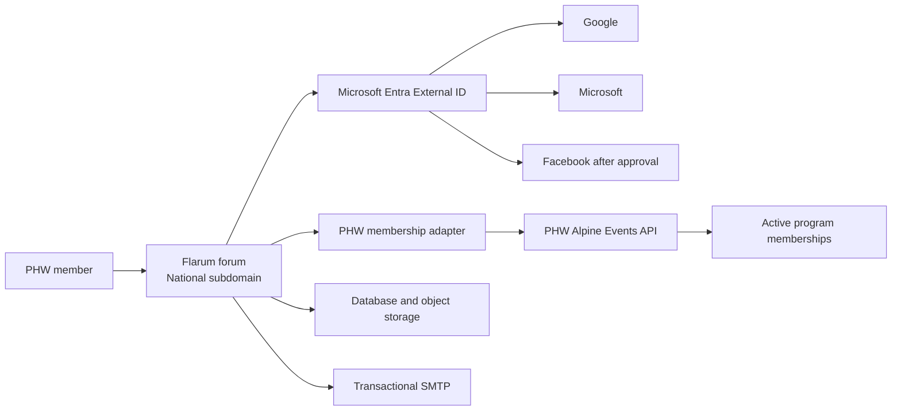

# ADR: National Community Forum on Flarum

Date: 2026-08-31
Status: Accepted for discovery and staging only

## Context

PHW programs need a moderated National space for appropriate community collaboration across program boundaries. The initial example is a program seeking fly-tying vises, so Gear Exchange is the first planned forum area; the service must also support other approved community discussions without becoming a marketplace or case-management system.

PHW already operates a multi-tenant events application. Its Entra External ID tenant provides member authentication, while active `tenant_membership` rows establish a person's current program access. The National Gear Exchange is a separate community service, not a tenant-isolated feature inside the Alpine Events database.

## Decision

Use self-hosted Flarum as the National Community Forum. Host it on a dedicated Azure Linux virtual machine and keep the existing PHW application as the authority for identity and membership eligibility.

The forum is private and members-only. A person may access it only when PHW can establish at least one active, non-expired, non-demo program membership. It is National and cross-program: program membership identifies a listing's origin and routes moderation but does not hide listings from other eligible programs.

The first release includes National announcements, program operations, skills and knowledge, and a sharing/coordination Gear Exchange area. Gear Exchange supports ISO and Available listings, replies, private messages, attachments, photos, pickup or shipping coordination, and an `open` to `fulfilled` lifecycle. The forum does not support payments, sales, auctions, escrow, inventory, shipping-label purchases, tax handling, commercial advertising, case management, or formal dispute adjudication.

## Topology

Run Flarum on an Ubuntu LTS VM with Nginx, PHP-FPM, Composer-managed application code, a supported database, transactional SMTP, off-box backups, and independent monitoring. Do not host Flarum in the existing Windows/IISNode App Service or add forum tables to Azure SQL.

Use the eventual National subdomain at the beginning of the pilot. This preserves URLs and limits a future hosting move to data export/import and infrastructure cutover.

## Identity Decision Gate

Flarum core has no PHW-ready equivalent to DiscourseConnect. Authentication is therefore an explicit staging gate, not an assumed configuration step.

1. First, validate one exact, version-pinned community OIDC/OAuth extension with Entra External ID.
2. The extension must associate users by immutable Entra subject, not email alone, and must allow PHW to enforce active membership server-side.
3. If it cannot meet the security and lifecycle test matrix in [flarum-entra-integration-design.md](flarum-entra-integration-design.md), build a narrowly scoped PHW-owned Flarum OIDC extension.
4. Do not create a second PHW identity provider, transmit Alpine Events bearer tokens to Flarum, or accept browser assertions as authorization evidence.

Entra External ID remains the identity broker. Reuse Google and Microsoft. Add Facebook only through a National-owned Meta application that has completed the required privacy, deletion, and production-review work. Instagram is excluded as an authentication option.

## Data Boundary

Flarum is responsible for forum discussions, posts, uploaded forum assets, flags, private messages, and forum moderation records. PHW Alpine Events remains responsible for membership, program affiliation, identity linkage, and its own event data. Alpine Events must not duplicate forum content into its database.

Flarum receives only the minimum required identity data: immutable subject, usable verified email, display name, and the program/group context needed for authorization and moderation. It must not receive phone numbers, street addresses, raw Entra claims, social-provider identifiers, internal member notes, or PHW event data.

## Consequences

### Benefits

- No recurring application-platform license cost; Flarum is MIT licensed.
- The community user experience, tags, permissions, flags, and discussions are provided by an established forum product.
- PHW keeps membership approval and program affiliation in the system already used for those decisions.
- The forum can grow independently of Colorado Alpine operations.

### Costs and Risks

- PHW owns Linux, PHP, Flarum, database, mail, backup, monitoring, incident response, and extension upgrades.
- OIDC and structured listing workflows rely on community extensions unless PHW builds the fallback extension.
- Flarum-to-another-platform migration is a future data-mapping project, not a turnkey promise.
- A named National operational owner is required before a production pilot begins.

## Non-Negotiable Guardrails

1. Demo-only, expired, revoked, or missing memberships never grant forum access.
2. Membership is evaluated server-side from all active memberships, never from a selected `X-Tenant-Id` header or browser storage.
3. Identity and forum outages fail closed for new access.
4. Secrets remain in Azure Key Vault or runtime secret injection, never in source control, screenshots, or operational evidence.
5. Do not log access tokens, authorization codes, state/nonce values, raw OIDC claims, email addresses, or signed redirect URLs.
6. All extensions are version-pinned, staged, security-reviewed, and listed in [flarum-extension-register.md](flarum-extension-register.md) before production use.
7. Restore testing is mandatory before the pilot and at least quarterly thereafter.

## References

- [Flarum installation](https://docs.flarum.org/install)
- [Flarum configuration](https://docs.flarum.org/config)
- [Flarum update guide](https://docs.flarum.org/update)
- [Flarum REST API](https://docs.flarum.org/rest-api)
- [PHW multi-tenant design](multi-tenant-design.md)
- [PHW Entra External ID runbook](entra-external-id-immediate-path.md)